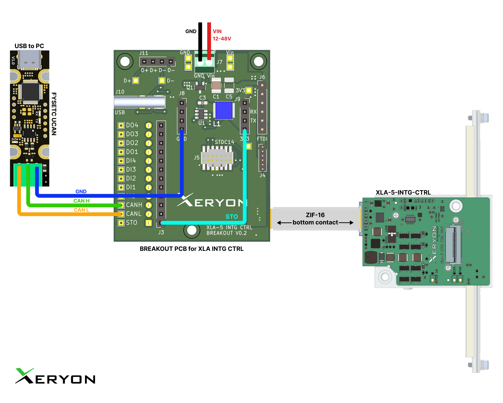

# Xeryon CANopen Example

This repository provides structured examples for working with CiA 402-compliant devices from Xeryon over CANopen. It includes modular scripts for configuration, homing, and profile position movement, using a consistent logging and state machine approach.

## Wiring

Before proceeding, please refer to the wiring diagram for the correct setup.

For this demo, we use the **Fysetc UCAN** USB-to-CAN adapter. However, you are free to use any compatible USB-to-CAN device.

Alternatively, you can also use a microcontroller or any other device that supports CAN communication.



---

## Installation

Before running any scripts, install the required Python packages:

### 1. Install dependencies

```bash
pip install -r requirements.txt
```

### 2. Interface Compatibility

Ensure your hardware (e.g., USB-to-CAN dongle) is supported by your system:

* For `slcan` over USB: install `pyserial`
* For Linux `socketcan`: ensure kernel CAN drivers are loaded

---

### 3. Change `config.py`

To configure the CAN interface and channel for your platform, open `config.py` and update the following values:

```python
# Interface (str): Interface type (e.g., "slcan", "socketcan").
CAN_INTERFACE = "slcan"

# Channel (str): CAN channel (e.g., "COM3", "/dev/ttyACM0").
CAN_CHANNEL = "COM3"
```

---

## File Structure and Purpose

| File                        | Description                                                                                                            |
|-----------------------------|------------------------------------------------------------------------------------------------------------------------|
| `example_configure.py`      | Configures the device: I/O, logging, motion profiles, and saves to flash                                               |
| `example_position.py`       | Executes a homing procedure using configured parameters,<br>sends target positions using CiA 402 Profile Position mode |
| `helpers.py`                | Reusable utility functions                                                                                             |
| `config.py`                 | Used for configuration and Enum constants                                                                              |
| `requirements.txt`          | Package requirements for Python environment setup                                                                      |
| `xeryon_xla_5_eds.eds`      | EDS File                                                                                                               |
| `xeryon_xla_5_eds_docu.txt` | Human-readable documentation of EDS fields                                                                             |

---

## READMEs

| Guide Type                                            | Description                         |
|-------------------------------------------------------|-------------------------------------|
| [Configuration](./README_configuration.md)            | How to set parameters and save them |
| [Homing](./README_homing.md)                          | How to execute a homing operation   |
| [Profile position mode](./README_profile_position.md) | Sending Profile Position commands   |

---

## EDS File and eds_docu.txt

### What is an EDS?

An EDS (Electronic Data Sheet) is a standardized INI-style file that describes the object dictionary of a CANopen device. It is required for correct SDO access and symbolic mapping of object names.

### What is `eds_docu.txt`?

This is a human-readable reference exported from the EDS for easier debugging and script development. It typically includes:

* Object indexes
* Subindex descriptions
* Access types and data types

### Where do I configure it?

The path to your `.eds` file is set in `config.py` as `EDS_PATH`:

```python
EDS_PATH = "../eds/xeryon_xla_5_eds.eds"
```

Make sure the actual `.eds` file is present or update the path accordingly.
