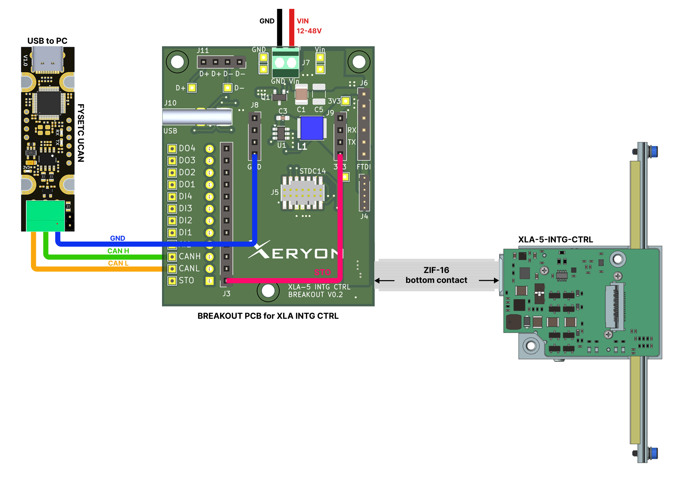

> [!NOTE]
> **Compatibility Notice**  
> The examples and code in this branch are compatible **only** with the following versions:  
> `bc18a32`  
> `464399b`


# Xeryon CANopen Example

This repository provides examples for working with CiA 402-compliant devices from Xeryon over CANopen. The repository includes installation instructions, communication setup, and Python programming examples for motion control.

## 1. Table of Contents

- [1. Table of Contents](#1-table-of-contents)
- [2. Wiring](#2-wiring)
- [3. Software Installation](#3-software-installation)
- [4. Quick Start](#4-quick-start)
- [5. Documentation](#5-documentation)
- [6. Project Structure](#6-project-structure)
- [7. FAQ \& Support](#7-faq--support)
- [8. Disclaimer](#8-disclaimer)


## 2. Wiring

> ⚠️ **Safety Warning:**
> Always disconnect power before wiring. Incorrect wiring while powered can damage the device.

Before proceeding, please refer to the wiring diagram for the correct setup. The wiring involves connecting the breakout board, STO, and power supply to the motor and CAN adapter.

We use the **Fysetc UCAN** USB-to-CAN adapter. However, you are free to use any compatible USB-to-CAN device. 

<!-- omit in toc -->
### 2.1. Wiring Steps

1. Ensure that the device is powered off and the power plug is disconnected.
2. Connect the FFC cable to the XLA. ([Wiring example](docs/wiring.md))
3. Connect the FFC cable to the breakout board.
4. Connect the STO (Safe Torque Off) pin to the 3.3V on the breakout board.
5. Connect the power cables to the screw terminals.
6. Verify that all connections are secure and correctly placed.
7. Connect power and switch on the power supply.

> **Note:** No LEDs will be on when the device is powered



## 3. Software Installation

<!-- omit in toc -->
### 3.1. Requirements

- **[Python 3.12 or higher](https://www.python.org/downloads/)** must be installed before continuing.  
- **[Visual Studio Code](https://code.visualstudio.com/)** recommended as the code editor.  
- **[Visual Studio Code Python Extension](https://marketplace.visualstudio.com/items?itemName=ms-python.python)** optional, but helpful when working with Python files.  

<!-- omit in toc -->
### 3.2. Install dependencies

You can install the requirements by running this command in the CMD.

```bash
pip install -r requirements.txt
```

<!-- omit in toc -->
### 3.3. Open the examples directory

Make sure that you are are in the directory `examples`

```bash
cd examples
```

<!-- omit in toc -->
### 3.4. Interface Compatibility

Ensure your hardware (e.g., USB-to-CAN) is connected and supported by your system:

* For Linux `socketcan`: ensure kernel CAN drivers are loaded

<!-- omit in toc -->
### 3.5. Change `settings.py`

To configure the CAN interface and channel for your platform, open `settings.py` and update the following values:

```python
# Encoder resolution
ENC_RES = EncoderRes.ENC_RES_1MU

# Default Node ID is 32
NODE_ID = 32

# Interface (str): Interface type (e.g., "slcan", "socketcan").
CAN_INTERFACE = "slcan"

# Channel (str): CAN channel (e.g., "COM3", "/dev/ttyACM0", "can0").
CAN_CHANNEL = "COM3"

# Default bitrate is 125Kbps
CAN_BITRATE = CANBitrate.BITRATE_125k

# Filename of the EDS file
EDS_PATH = "../eds/xeryon_xla_5_eds.eds"
```

## 4. Quick Start

Ensure you have updated `settings.py` with your CAN interface details first. <br>
To quickly verify the communication of your setup, run:

```bash
python tests/verify_communication.py
```

To configure the device and save the parameters, run:

```bash
python configuration.py
```

This will configure all the configuration settings to the (default) values. 
An error will occur when there is a communication issue.

You can also run other examples:

```bash
python <filename>.py
```

## 5. Documentation

These are detailed guides on how to configure, home, and perform motion with the motor:

| Guide Type                                                                                      | Description                         |
| ----------------------------------------------------------------------------------------------- | ----------------------------------- |
| [CANopen documentation](https://xeryon.com/wp-content/uploads/2025/08/CANopen-Introduction.pdf) | CANopen introduction manual         |
| [Configuration](docs/configuration.md)                                                          | How to set parameters and save them |
| [Homing](docs/homing.md)                                                                        | How to execute a homing operation   |
| [Profile Position mode](docs/mode_profile_position.md)                                          | How to use profile position mode    |
| [Daisy Chaining](docs/daisy_chaining.md)                                                        | How to use daisy chaining           |
| [Wiring example](docs/wiring.md)                                                                | Wiring example                      |
| [EDS](docs/eds.md)                                                                              | EDS file information                |
| [FAQ](FAQ.md)                                                                                   | Frequently asked questions          |

## 6. Project Structure

```
.
├── docs/
│   ├── configuration.md              # Guide for configuration                             
│   ├── daisy_chaining.md             # Guide for daisy chaining
│   ├── eds.md                        # Information about EDS
│   ├── homing.md                     # Guide for homing
│   ├── mode_profile_position.md      # Guide for mode profile position
│   └── wiring.md                     # Wiring example
│   
├── eds/
│   ├── xeryon_xla_5_eds.eds          # EDS file
│   └── xeryon_xla_5_eds_docu.txt     # Documentation of EDS fields
│   
├── examples/                         # Code Examples
│   ├── common/
│   │   ├── parameters.py             # Hardcoded parameters, values and enums
│   │   └── utils.py                  # Shared functions
│   │
│   ├── daisy_chaining_configuration/
│   │   ├── change_node_id_all.py     # Example to automatically reassign all Node IDs
│   │   └── change_node_id_single.py  # Example to change Node ID of specific node
│   │
│   ├── tests/
│   │   └── verify_communication.py   # Script to verify the communication of a node
│   │
│   ├── configuration.py              # Example script for configuration
│   ├── homing.py                     # Example script for homing
│   └── mode_profile_position.py      # Example script for mode profile position
│
├── FAQ.md                            # Frequently asked questions
├── README.md                         # General Guide for running the examples
└── requirements.txt                  # Dependency file for python setup
```

## 7. FAQ & Support

Please refer to the [FAQ](FAQ.md) for a complete list of common questions and answers.

If you need further assistance with this software or any Xeryon product, please contact our support team: 
[support@xeryon.com](mailto:support@xeryon.com)

## 8. Disclaimer

The software and accompanying documentation are provided "as is" and without
warranty of any kind, express or implied, including but not limited to the
warranties of merchantability, fitness for a particular purpose, and
noninfringement. In no event shall Xeryon be liable for any claim, damages, or
other liability, whether in an action of contract, tort, or otherwise, arising
from, out of, or in connection with the software or its use.
