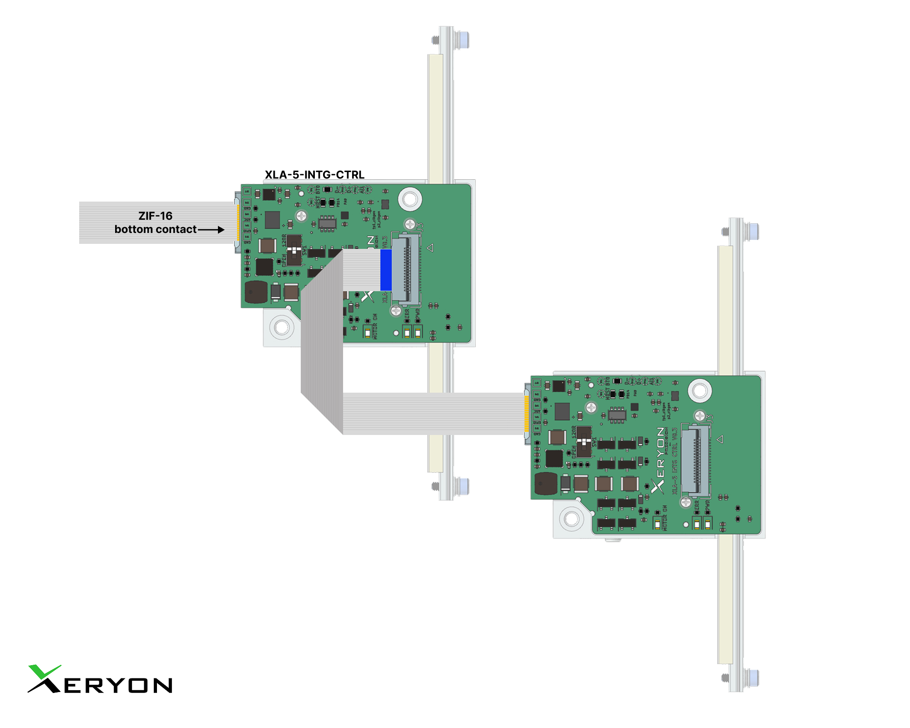
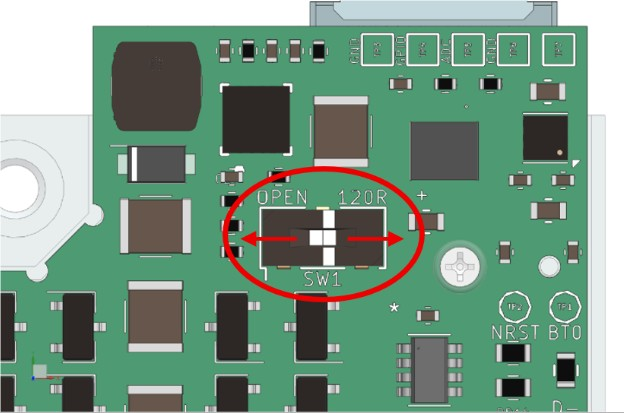

# Daisy-Chaining Guide

This guide explains how to set up daisy-chaining for Xeryon devices over CANopen, including wiring, power considerations, and software configuration.

## What is Daisy-Chaining?

**Daisy-chaining** is a method of connecting multiple devices on the same CAN bus by linking them in sequence.
It allows multiple XLA devices to be controlled through a single CAN adapter.

## Power Considerations

When connecting more devices, a higher supply voltage is required to ensure stable operation:

| Supply Voltage     | Maximum Supported Devices |
| ------------------ | ------------------------- |
| 12-55 V DC (10W)   | 1                         |
| 24-55 V DC (20W)   | 2                         |
| 36-55 V DC (30W)   | 3                         |
| 48-55 V DC (40W)   | 4                         |

> Note: Devices can be grouped on a single breakout (maximum **4 per breakout** using the FFC cable). Multiple breakouts can then be daisy-chained to build larger networks. As the network grows, **baudrate limits** will influence communication performance.


## Wiring

* The **FFC cable** can only support up to **4 XLAs** in a daisy-chain per breakout board.
* For larger setups, chain **breakout boards** together via the CAN lines on the breakout board.




## Termination Resistor Switch

Each breakout board includes a switch to enable/disable a **120 Ω termination resistor**.

* **Enable termination only on the last device** in the chain, because the **master/controller typically provides the first termination**.
* If your master/controller **does not** provide termination, enable termination on the **first and last** device.
* All **intermediate devices** must have termination **disabled**.

Correct termination is essential for a stable CAN bus.



> Note: CAN bus termination can be set with switch SW1. When the slider is set towards 120 R, termination is enabled. No termination is present when set towards OPEN.

## Node IDs

By default, **all Xeryon devices use Node ID = 32**.
For daisy-chaining, each device must have a **unique Node ID**.

### Assign all nodes automatically

Use the provided script to automatically assign all nodes to an unique Node ID:

```bash
python examples/daisy_chaining_configuration/change_node_id_all.py
```

* The script scans the CAN network for devices.
* It assigns sequential IDs starting from `START_NODE_ID = 32`.
* Example assignment: **32, 33, 34, 35**.

### Assign a specific node to a new Node ID

Use the provided script to assign a single node to a new Node ID:

```bash
python examples/daisy_chaining_configuration/change_node_id_single.py
```
